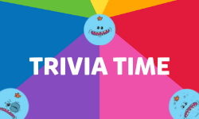

<!--
*** Thanks for checking out the Best-README-Template. If you have a suggestion
*** that would make this better, please fork the repo and create a pull request
*** or simply open an issue with the tag "enhancement".
*** Don't forget to give the project a star!
*** Thanks again! Now go create something AMAZING! :D
-->

[![LinkedIn][linkedin-shield]][linkedin-url]

<!-- PROJECT LOGO -->
 

  

<h3 align="center">Trivia Time Quiz App</h3>

  

Trivia Time is a quiz app built using React that utilizes REST APIs and AJAX requests to generate avatars and present multiple choice questions to users based on their chosen category and difficulty. The app also uses Firebase to store persistent data such as user avatars and scores. The app's design was created using CSS and the overall theme and feel was inspired by top charting quiz apps
     
    <a href="https://github.com/PPableo/quiz-app-junoCollegeProject4"><strong>Explore the docs »</strong></a>
     
     
    <a href="https://meeseeks-trivia.netlify.app/">View Demo</a>
    ·
    <a href="https://github.com/PPableo/quiz-app-junoCollegeProject4/issues">Report Bug</a>
    ·
    <a href="https://github.com/PPableo/quiz-app-junoCollegeProject4/issues">Request Feature</a>
  

<!-- TABLE OF CONTENTS -->

  
Table of Contents

  <ol>
    <li>
      <a href="#about-the-project">About The Project</a>
      <ul>
        <li><a href="#built-with">Built With</a></li>
      </ul>
    </li>
    <li><a href="#usage">Usage</a></li>
    <li><a href="#roadmap">Roadmap</a></li>
    <li><a href="#contact">Contact</a></li>
    <li><a href="#acknowledgments">Acknowledgments</a></li>
  </ol>

<!-- ABOUT THE PROJECT -->
## About The Project

[![Product Name Screen Shot][product-screenshot]](https://meeseeks-trivia.netlify.app/)

### Built With

* [![HTML5][HTML5.js]][HTML-url]
* [![SASS][SASS.js]][SASS-url]
* [![React][React.js]][React-url]

(<a href="#readme-top">back to top</a>)

<!-- USAGE EXAMPLES -->
## Usage

This app is collaborative project with built using #react. We utilized 2 APIs and persistent data via Firebase to allow users to save User Avatar and score. We Utilized 2 REST API data via AJAX request to randomly generate avatar, as well as take user input for Trivia category, and difficulty.

This app is designed to test your knowledge and challenge you with various questions from a range of categories. To start playing, simply enter your name to create an avatar, select a category from the main menu and choose your difficulty. The app will then present you with a series of multiple choice questions, and you can select your answer by tapping on one of the options. After you have answered all of the questions, the app will show you your score and give you the option to play again.

_For more examples, please refer to the [Documentation](https://example.com)_

(<a href="#readme-top">back to top</a>)

<!-- ROADMAP -->
## Roadmap

- [ ] High-score
- [ ] Leader board
- [ ] Multiple Players

See the [open issues](https://github.com/PPableo/quiz-app-junoCollegeProject4/issues) for a full list of proposed features (and known issues).

(<a href="#readme-top">back to top</a>)

<!-- CONTACT -->
## Contact

https://paulpableo.com/

Project Link: [https://github.com/PPableo/quiz-app-junoCollegeProject4](https://github.com/PPableo/quiz-app-junoCollegeProject4)

(<a href="#readme-top">back to top</a>)

<!-- ACKNOWLEDGMENTS -->
## Acknowledgments

* [Mr. Meeseeks](https://rickandmorty.fandom.com/wiki/Mr._Meeseeks)
* [Trivia Crack](https://triviacrack.com/)

(<a href="#readme-top">back to top</a>)

<!-- MARKDOWN LINKS & IMAGES -->
<!-- https://www.markdownguide.org/basic-syntax/#reference-style-links -->
[contributors-shield]: https://img.shields.io/github/contributors/github_username/quiz-app-junoCollegeProject4.svg?style=for-the-badge
[contributors-url]: https://github.com/PPableo/quiz-app-junoCollegeProject4/graphs/contributors
[issues-shield]: https://img.shields.io/github/issues/PPableo/quiz-app-junoCollegeProject4.svg?style=for-the-badge
[issues-url]: https://github.com/PPableo/quiz-app-junoCollegeProject4/issues
[linkedin-shield]: https://img.shields.io/badge/-LinkedIn-black.svg?style=for-the-badge&logo=linkedin&colorB=555
[linkedin-url]: https://linkedin.com/in/paulpableo
[product-screenshot]: images/screenshot.png
[HTML5.js]: https://img.shields.io/badge/HTML-E34F26?style=for-the-badge&logo=html5&logoColor=white
[HTML-url]: https://developer.mozilla.org/en-US/docs/Glossary/HTML5/
[React.js]: https://img.shields.io/badge/React-20232A?style=for-the-badge&logo=react&logoColor=61DAFB
[React-url]: https://reactjs.org/
[SASS.js]: https://img.shields.io/badge/SASS-CC6699?style=for-the-badge&logo=SASS&logoColor=white
[SASS-url]: https://sass-lang.com/
